# GO-Commerce Model Context Protocol (MCP)


An AI-first e-commerce interface that enables customers to interact with AI agents for shopping experiences, while store management uses traditional GUIs. The MCP service bridges AI agents (via n8n/Vertex AI) with GO-Commerce backend systems, providing secure, tenant-aware access to product catalogs, inventory, and order processing.

## Table of Contents

- [Architecture](#architecture)
- [Documentation](#documentation)
  - [Core Documentation](#core-documentation)
  - [Architecture Documentation](#architecture-documentation)
- [Quick Start](#quick-start)
- [Technology Stack](#technology-stack)
- [Development](#development)
- [Testing](#testing)
- [Configuration](#configuration)
- [Contributing](#contributing)
- [License](#license)

## Architecture


The MCP service operates as a secure bridge between AI agents and the GO-Commerce ecosystem:

```mermaid
flowchart TB
    AI["🤖 AI Host<br/>(Gemini/Claude)"] 
    
    subgraph MCP["GO-Commerce MCP Service"]
        Gateway["🚪 API Gateway<br/>REST/GraphQL + JWT"]
        Context["🗄️ Data Context Layer<br/>Multi-tenant Access"]
        Events["⚡ Event Processor<br/>Streaming & Updates"]
        
        Gateway --> Context
        Gateway --> Events
    end
    
    Platform["🏪 GO-Commerce<br/>Platform"]
    DB["🐘 PostgreSQL<br/>Per-tenant Schemas"]
    Kafka["📡 Kafka Events<br/>Event Streaming"]
    
    AI -.->|"REST/GraphQL + JWT"| Gateway
    Gateway <-->|"Integrates"| Platform
    Context <-->|"Reads/Writes"| DB
    Events <-->|"Streams"| Kafka
    
    classDef aiNode fill:#e1f5fe,stroke:#01579b,stroke-width:2px
    classDef mcpNode fill:#f3e5f5,stroke:#4a148c,stroke-width:2px
    classDef extNode fill:#e8f5e8,stroke:#1b5e20,stroke-width:2px
    
    class AI aiNode
    class Gateway,Context,Events mcpNode
    class Platform,DB,Kafka extNode
```



### Core Components


#### Why These Components Are Essential:

**1. Data Context Layer (DCL)**
- **Multi-tenant Schema Management**: Each tenant's data lives in a separate PostgreSQL schema (`tenant_{{tenantId}}`)
- **Context Switching**: Automatically resolves and switches to the correct tenant schema based on JWT claims
- **Query Routing**: Routes database queries to the appropriate tenant schema without manual intervention
- **Security Enforcement**: Prevents accidental cross-tenant data access through schema isolation

**2. Event Processor**
- **Real-time AI Context**: AI agents need up-to-date information, not stale cached data
- **Cache Synchronization**: Invalidates cached data when the underlying GO-Commerce data changes
- **Cross-tenant Updates**: Handles platform-wide events that might affect multiple tenants
- **Audit Trail**: Tracks all data access and modifications for compliance

**3. API Gateway**
- **Authentication**: Validates JWT tokens from AI systems
- **Tenant Resolution**: Extracts tenant ID from JWT and sets context
- **Rate Limiting**: Prevents AI systems from overwhelming tenant resources

**4. Security Layer**
- **Zero-trust Architecture**: Every request must be authenticated and authorized
- **Schema-level Isolation**: PostgreSQL schemas provide strong tenant boundaries

## Documentation

The MCP service documentation follows a **Specs-Driven Development (SDD)** approach:

### Core Documentation

- **[WARP.md](./WARP.md)**: High-level service specification and requirements
- **[PLAN.md](./PLAN.md)**: Detailed technical implementation plan
- **[TASKS.md](./TASKS.md)**: Granular task checklist with 120+ actionable items

### Architecture Documentation

The detailed architecture documentation is organized as follows:


### Key Documentation

- [WARP.md](./WARP.md): Service specification and developer guidance
- [PLAN.md](./PLAN.md): Complete technical implementation blueprint
- [TASKS.md](./TASKS.md): Actionable development checklist
- [Core Architecture](./docs/architecture/core-architecture.md): System design and components
- [Technical Stack](./docs/architecture/technical-stack.md): Dependencies and configurations
- [ADRs](./docs/architecture/adr/): Key architectural decisions
- [Runbooks](./docs/operations/runbooks.md): Operational procedures

## Quick Start

Get the MCP service running in development mode:

```bash
# Start required infrastructure
cd ../docker && docker-compose --env-file .env up -d postgres keycloak-db keycloak

# Run in dev mode with hot reload
mvn quarkus:dev

# Enable continuous testing
mvn quarkus:dev -Dquarkus.test.continuous-testing=enabled
```

### Docker-Based Development

```bash
# Start complete environment
cd ../docker && docker-compose --env-file .env up -d mcp

# View logs
cd ../docker && docker-compose --env-file .env logs -f mcp
```

## Technology Stack


## Development

### Development Approach

This project follows a **Specs-Driven Development (SDD)** methodology:

1. **Specification** ([WARP.md](./WARP.md)): High-level requirements and architecture
2. **Planning** ([PLAN.md](./PLAN.md)): Technical implementation blueprint
3. **Task Breakdown** ([TASKS.md](./TASKS.md)): Granular, actionable checklist
4. **Implementation**: Task-by-task development with Git workflow

### Prerequisites

- JDK 21+
- Maven 3.8+
- Docker & Docker Compose
- PostgreSQL 15+
- Keycloak 21+

### Build and Test

```bash
# Build the project
./mvnw package

# Run tests
./mvnw test

# Run specific test
mvn test -Dtest=DataServiceTest

# Run with coverage
../docker/run-tests.sh mcp-coverage
```

### Code Style

```bash
# Run checkstyle
mvn checkstyle:check
```

## Configuration

Essential configuration properties (see [Configuration Guide](./docs/architecture/core-architecture.md#configuration) for full details):

```properties
# Core settings
quarkus.application.name=mcp-server
quarkus.http.port=8080

# Multi-tenancy
quarkus.hibernate-orm.multitenant=SCHEMA
quarkus.hibernate-orm.database.generation=none
```

## Contributing


## License

Copyright (c) 2024 TioDaTI.dev. All rights reserved.

For licensing details, see:
- [COMMERCIAL_LICENSE](../COMMERCIAL_LICENSE) - For commercial use
- [LICENSE](../LICENSE) - For personal and educational use

// Copilot: This file may have been generated or refactored by GitHub Copilot.
