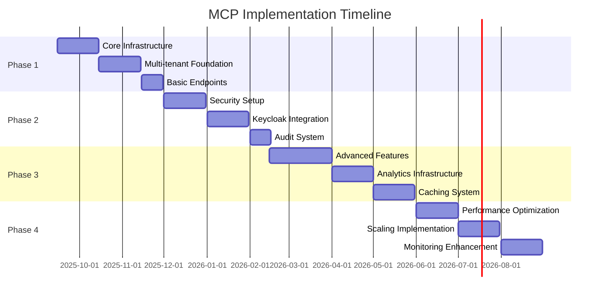

# GO-Commerce MCP Server Implementation Roadmap

## Overview

This document outlines the phased implementation plan for the GO-Commerce MCP service. The roadmap is designed to deliver incremental value while managing complexity and risk effectively. Each phase builds upon the previous one, ensuring a stable and secure foundation for subsequent features.

## Phase 1: Core Infrastructure and Basic Multi-tenancy

### 1.1 Goals

- Establish basic MCP service infrastructure
- Implement core multi-tenant architecture
- Set up basic service endpoints
- Create foundational testing framework

### 1.2 Key Deliverables

1. **Core Service Setup**
   - Basic Quarkus application structure
   - Maven project configuration
   - Docker containerization
   - CI/CD pipeline setup

2. **Multi-tenant Foundation**
   - Tenant context management
   - Schema-per-tenant PostgreSQL setup
   - Basic tenant resolver
   - Tenant isolation tests

3. **Basic Service Endpoints**
   - Health check endpoints
   - Basic data access endpoints
   - Metrics endpoints
   - OpenAPI documentation

### 1.3 Success Criteria

- [ ] Service deploys successfully to development environment
- [ ] Multi-tenant isolation verified through tests
- [ ] Basic endpoints operational and documented
- [ ] CI/CD pipeline operational
- [ ] Container builds and deploys successfully

### 1.4 Risk Mitigation

| Risk | Mitigation Strategy |
|------|-------------------|
| Schema isolation failure | Comprehensive testing suite, RLS implementation |
| Performance issues | Early performance testing, monitoring setup |
| Deployment problems | Infrastructure as Code, automated rollback |

## Phase 2: Security Layer and Keycloak Integration

### 2.1 Goals

- Implement comprehensive security infrastructure
- Integrate Keycloak authentication
- Establish RBAC framework
- Set up audit logging

### 2.2 Key Deliverables

1. **Authentication Infrastructure**
   - Keycloak integration
   - JWT validation
   - Token introspection
   - Security filter chain

2. **Authorization Framework**
   - Role-based access control
   - Permission management
   - Tenant-aware security
   - Security testing framework

3. **Audit System**
   - Audit logging
   - Security event tracking
   - Compliance reporting
   - Audit trail management

### 2.3 Success Criteria

- [ ] Successful Keycloak authentication
- [ ] RBAC properly enforcing permissions
- [ ] Audit logs capturing all required events
- [ ] Security tests passing
- [ ] Compliance requirements met

### 2.4 Risk Mitigation

| Risk | Mitigation Strategy |
|------|-------------------|
| Authentication bypass | Comprehensive security testing, penetration testing |
| Authorization leaks | Role verification testing, security audits |
| Compliance gaps | Regular compliance reviews, automated checks |

## Phase 3: Advanced Features and Cross-tenant Analytics

### 3.1 Goals

- Implement advanced MCP features
- Develop cross-tenant analytics
- Add caching layer
- Enhance performance

### 3.2 Key Deliverables

1. **Advanced MCP Features**
   - Context-aware data access
   - Real-time updates
   - Event streaming
   - WebSocket integration

2. **Analytics Infrastructure**
   - Data warehouse integration
   - Analytics engine setup
   - Cross-tenant reporting
   - Data anonymization

3. **Caching System**
   - Redis integration
   - Cache management
   - Cache invalidation
   - Performance optimization

### 3.3 Success Criteria

- [ ] Advanced features operational
- [ ] Analytics producing accurate reports
- [ ] Caching improving performance
- [ ] Real-time updates working
- [ ] Cross-tenant analytics respecting isolation

### 3.4 Risk Mitigation

| Risk | Mitigation Strategy |
|------|-------------------|
| Data leaks | Strict isolation testing, access controls |
| Performance degradation | Load testing, performance monitoring |
| Cache consistency | Cache validation, automated testing |

## Phase 4: Performance Optimization and Scaling

### 4.1 Goals

- Optimize service performance
- Implement advanced scaling
- Enhance monitoring
- Improve reliability

### 4.2 Key Deliverables

1. **Performance Optimization**
   - Query optimization
   - Connection pooling
   - Resource management
   - Thread optimization

2. **Scaling Infrastructure**
   - Horizontal scaling setup
   - Load balancing
   - Auto-scaling configuration
   - Resource quotas

3. **Advanced Monitoring**
   - Detailed metrics
   - Custom dashboards
   - Alerting rules
   - Performance tracking

### 4.3 Success Criteria

- [ ] Performance meeting SLAs
- [ ] Successful scaling tests
- [ ] Monitoring providing insights
- [ ] Resource usage optimized
- [ ] System handling peak loads

### 4.4 Risk Mitigation

| Risk | Mitigation Strategy |
|------|-------------------|
| Resource exhaustion | Resource limits, monitoring |
| Scaling issues | Gradual scaling, testing |
| Performance regression | Continuous performance testing |

## Implementation Timeline



## Success Metrics

### 1. Technical Metrics

| Metric | Target | Critical |
|--------|---------|----------|
| Response Time P95 | < 500ms | Yes |
| Error Rate | < 1% | Yes |
| Test Coverage | > 80% | Yes |
| Memory Usage | < 80% | No |
| CPU Usage | < 70% | No |

### 2. Business Metrics

| Metric | Target | Critical |
|--------|---------|----------|
| Tenant Isolation | 100% | Yes |
| Data Accuracy | 100% | Yes |
| System Uptime | 99.9% | Yes |
| Query Performance | < 100ms | No |
| Feature Adoption | > 80% | No |

## Risk Management Strategy

### 1. Technical Risks

| Risk Category | Mitigation Approach | Monitoring |
|---------------|-------------------|------------|
| Data Isolation | Schema validation, RLS | Continuous testing |
| Performance | Load testing, optimization | Real-time metrics |
| Security | Regular audits, testing | Security scanning |
| Scalability | Architecture review, testing | Resource monitoring |

### 2. Business Risks

| Risk Category | Mitigation Approach | Monitoring |
|---------------|-------------------|------------|
| Adoption | User training, documentation | Usage metrics |
| Compliance | Regular audits, updates | Compliance checking |
| Integration | API versioning, testing | Integration tests |
| Support | Documentation, training | Support metrics |

## Milestone Definitions

### Phase 1 Milestones

1. **M1.1: Core Infrastructure Complete**
   - Basic service operational
   - Docker container working
   - CI/CD pipeline running

2. **M1.2: Multi-tenant Foundation**
   - Tenant isolation working
   - Database schemas setup
   - Basic data access working

3. **M1.3: Basic Service Operations**
   - Endpoints operational
   - Basic monitoring working
   - Documentation complete

### Phase 2 Milestones

1. **M2.1: Security Infrastructure**
   - Keycloak integration complete
   - JWT validation working
   - RBAC operational

2. **M2.2: Audit System**
   - Audit logging working
   - Security events tracked
   - Compliance reporting ready

### Phase 3 Milestones

1. **M3.1: Advanced Features**
   - Context management working
   - Real-time updates operational
   - Event streaming ready

2. **M3.2: Analytics Ready**
   - Data warehouse integrated
   - Cross-tenant reporting working
   - Caching system operational

### Phase 4 Milestones

1. **M4.1: Performance Optimized**
   - Query optimization complete
   - Resource usage optimized
   - Scaling tested

2. **M4.2: System Production Ready**
   - All monitoring in place
   - SLAs met
   - Documentation complete

## Quality Gates

### 1. Code Quality Gates

```yaml path=null start=null
quality_gates:
  code_coverage:
    minimum: 80%
    critical: true
    
  code_quality:
    sonar:
      bugs: 0
      vulnerabilities: 0
      code_smells: < 10
      
  security:
    owasp_dependency_check:
      critical: 0
      high: 0
    
  performance:
    response_time_p95: 500ms
    error_rate: 1%
```

### 2. Release Gates

```yaml path=null start=null
release_gates:
  security_scan:
    required: true
    criteria:
      critical_issues: 0
      high_issues: 0
      
  performance_test:
    required: true
    criteria:
      response_time_p95: 500ms
      error_rate: 1%
      
  integration_test:
    required: true
    criteria:
      pass_rate: 100%
      
  compliance_check:
    required: true
    criteria:
      violations: 0
```

## Rollback Procedures

### 1. Deployment Rollback

```bash path=null start=null
#!/bin/bash

rollback_deployment() {
    ENV=$1
    VERSION=$2
    
    echo "Rolling back ${ENV} to version ${VERSION}"
    
    # Stop current version
    kubectl scale deployment mcp-server -n gocommerce-${ENV} --replicas=0
    
    # Deploy previous version
    kubectl set image deployment/mcp-server \
        mcp-server=gocommerce/mcp-server:${VERSION} \
        -n gocommerce-${ENV}
        
    # Scale up previous version
    kubectl scale deployment mcp-server -n gocommerce-${ENV} --replicas=3
    
    # Verify rollback
    verify_deployment ${ENV}
}

# Usage
# rollback_deployment staging v1.2.3
```

### 2. Database Rollback

```bash path=null start=null
#!/bin/bash

rollback_database() {
    ENV=$1
    VERSION=$2
    
    echo "Rolling back database in ${ENV} to version ${VERSION}"
    
    # Execute flyway rollback
    ./mvnw flyway:undo \
        -Dflyway.configFiles=flyway-${ENV}.conf \
        -Dflyway.target=${VERSION}
        
    # Verify database state
    verify_database ${ENV}
}

# Usage
# rollback_database staging 1.2.3
```

## Monitoring and Alerts

### 1. Performance Monitoring

```yaml path=null start=null
monitoring:
  metrics:
    - name: response_time
      threshold: 500ms
      window: 5m
      alert: critical
      
    - name: error_rate
      threshold: 1%
      window: 5m
      alert: critical
      
    - name: cpu_usage
      threshold: 70%
      window: 10m
      alert: warning
      
    - name: memory_usage
      threshold: 80%
      window: 10m
      alert: warning
```

### 2. Security Monitoring

```yaml path=null start=null
security_monitoring:
  metrics:
    - name: failed_auth
      threshold: 10
      window: 5m
      alert: critical
      
    - name: tenant_violations
      threshold: 1
      window: 1h
      alert: critical
      
    - name: suspicious_queries
      threshold: 5
      window: 15m
      alert: warning
```

## Documentation Requirements

### 1. Technical Documentation

- Architecture specifications
- API documentation
- Security documentation
- Operations manual
- Development guide

### 2. Operational Documentation

- Deployment procedures
- Monitoring guide
- Incident response
- Backup procedures
- Recovery procedures

## Training Plan

### 1. Development Team

- Multi-tenant architecture
- Security principles
- Performance optimization
- Monitoring and operations

### 2. Operations Team

- Deployment procedures
- Monitoring setup
- Incident response
- Performance tuning
- Security operations

// Copilot: This file may have been generated or refactored by GitHub Copilot.
